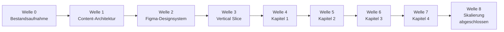

# Fachkunde-Fortschritt

Dieser Tracker zeigt, an welchem Punkt der Fachkunde-Masterplanung die Arbeit gerade steht.
Er wird nach jedem Arbeitspaket aktualisiert.

## Statuslegende

| Zeichen | Bedeutung |
|---|---|
| `[x]` | abgeschlossen |
| `[>]` | aktuell in Arbeit |
| `[ ]` | offen |
| `[!]` | blockiert oder braucht Entscheidung/Freigabe |

## Aktueller Punkt

**Aktuell:** Masterplan-Wellen 0–8 technisch abgeschlossen. Offene Restarbeit ist fachlich (Ausbilderfreigabe/Fundstellen) bzw. produktseitig spaeter (DB-Import, Analytics-Pipeline).

Konkreter Stand:

- `[x]` Welle 0: Repo-, Datenmodell-, Design- und Content-Bestandsaufnahme
- `[x]` Welle 1: Content-Matrix und Fachkunde-Schemas als Planungsgrundlage
- `[x]` Welle 2: Figma-Designsystem (inkl. Screens, Prototyp, Dark-Mode in Color Light)
- `[x]` Welle 3: Vertical Slice `Messschieber und Toleranzen`
- `[x]` Welle 4: Kapitel 1 vollstaendig ausbauen (inkl. BER-004 bis BER-008)
- `[x]` Welle 5: Kapitel 2 vollstaendig ausbauen
- `[x]` Welle 6: Kapitel 3 vollstaendig ausbauen
- `[x]` Welle 7: Kapitel 4 vollstaendig ausbauen
- `[x]` Welle 8: Skalierung und Qualitaet (technisch)

## Visualisierung

## Welle 2: Figma-Designsystem

Figma-Datei: https://www.figma.com/design/wr0cGrNxC6kpOV1TalCgx9

| Schritt | Status | Ergebnis |
|---|---|---|
| 2.1 | `[x]` | Figma-Datei fuer `BZE Online Campus - Fachkunde` angelegt |
| 2.2 | `[x]` | Bestehende Code-Tokens aus `app/globals.css` und `tailwind.config.ts` ausgewertet |
| 2.3 | `[x]` | Foundations-Seite `00 Foundations` mit sichtbarem Status |
| 2.4 | `[x]` | Farbvariablen Light; Dark-Mode in `BZE Color Light` nach Pro-Upgrade ergaenzt |
| 2.5 | `[x]` | Spacing- und Radius-Variablen angelegt |
| 2.6 | `[x]` | Typografie- und Schatten-Stile angelegt |
| 2.7 | `[x]` | Light/Dark als Modi in `BZE Color Light` (Dark Reference bleibt als Quelle) |
| 2.8 | `[x]` | 11 Components inkl. Mini-Wissenscheck und Pruefungsrelevanz-Badge |
| 2.9 | `[x]` | 8 Screens: Lernpfad, Lerneinheit, Glossar, Formeltrainer, Fehlerdiagnose, Ausbilderfreigabe, Toleranzfeld, Spritzgiesszyklus |
| 2.10 | `[x]` | 3 Click-Prototypen: Messschieber-Slice, Toleranzfeld→Diagnose, Spritzgiesszyklus↔Fehlerdiagnose |

Seiten: `00 Foundations`, `01 Learning Components`, `02 Screens`, `03 Prototypes`, `04 Technical Illustrations` (8 Illustration-Components), `05 Gamification`.

## Welle 3 bis 7

Kapitel 1–4 sind als MDX-Entwurf vollstaendig umgesetzt (Visual, Interaktion, Mini-Wissenscheck, Quellenstatus, Freigabehinweis). Details in `docs/FACHKUNDE_MASTERPLAN.md`.

## Welle 8: Skalierung und Qualitaet

| Schritt | Status | Ergebnis |
|---|---|---|
| 8.1 | `[x]` | Content-Matrix gegen MDX abgeglichen; BER-004 bis BER-008 nachgezogen |
| 8.2 | `[x]` | Alte `PT-WS`-Demo-Dateien entfernt; Vertical-Slice-Demo bewusst behalten |
| 8.3 | `[x]` | Freigabe-Workflow technisch: Inventar-CLI, Admin-Seite, JSON-Report. Fachliche Freigabe/Fundstellen bleiben Ausbilderprozess. |
| 8.4 | `[x]` | Glossar-/Formel-Domain-Schemas + Import-Checks. DB-Migration/Produkt-Import bewusst spaeter. |
| 8.5 | `[x]` | Figma Screens/Prototyp nach Professional+Full Upgrade hergestellt |
| 8.5b | `[x]` | Design-to-Code Kernflow: Lernpfad-Statuskarten + Lerneinheit-Chrome in Campus-UI |
| 8.6 | `[x]` | Struktur-/A11y-Audit (`fachkunde:audit`): 299/299 Pflichtbausteine, 93 SVGs mit `role=img`+`aria-labelledby` |
| 8.7 | `[x]` | Review-Oberflaeche da; Lernereignis-Schema fuer spaetere Analytics-Pipeline angelegt |

Inventar-Stand: 299 gesamt, 299 Entwurf (Einheit), **299 Fragen freigegeben**, 0 Einheiten freigegeben, 299 quellenoffen, 0 unvollstaendig.

## Abarbeitungsregel

1. Jede Einheit bleibt `Entwurf`, bis eine fachliche Freigabe erfolgt.
2. Mini-Wissenscheck-Fragen koennen separat ueber `fragen_status: freigegeben` freigegeben sein.
3. Keine verbindlichen Zahlenwerte ohne Fundstelle.
4. Keine IHK/PAL-Originalaufgaben.

## Naechster Schritt (nach Welle 8)

1. Ausbilder: Quellenfundstellen setzen und Einheiten freigeben (`review_status`).
2. Optional Produkt: Glossar-/Formel-DB, Mini-Quiz-Import, Analytics-Persistenz.
3. Optional Design: weitere Figma-Screens (Glossar/Formel/Diagnose) und Library/Code Connect.
   Kernflow (Lernpfad + Lerneinheit) ist bereits in der Campus-UI umgesetzt.
